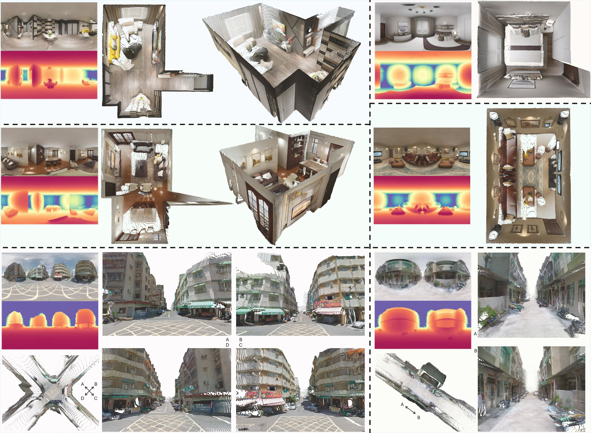

# &nbsp;DA<sup>2</sup>: Depth Anything in Any Direction

[](https://depth-any-in-any-dir.github.io/)
[](http://arxiv.org/abs/2509.26618)
[-green)]()
[](https://huggingface.co/spaces/haodongli/DA-2)
[](https://docs.google.com/presentation/d/1QUonqLuYGEh0qcqY72pbTXsZimINlyN4rOogy7qX4GY/edit?usp=sharing)
[](https://github.com/EnVision-Research/DA-2#-citation)

[Haodong Li](https://haodong2000.github.io/)<sup>123&sect;</sup>,
[Wangguangdong Zheng](https://wangguandongzheng.github.io/)<sup>1</sup>,
[Jing He](https://jingheya.github.io/)<sup>3</sup>,
[Yuhao Liu](https://yuhaoliu7456.github.io/)<sup>1</sup>,
[Xin Lin](https://linxin0.github.io/)<sup>2</sup>,
[Xin Yang](https://abnervictor.github.io/2023/06/12/Academic-Self-Intro.html)<sup>34</sup>,<br>
[Ying-Cong Chen](https://www.yingcong.me/)<sup>34&#9993;</sup>,
[Chunchao Guo]()<sup>1&#9993;</sup>

<span class="author-block"><sup>1</sup>Tencent Hunyuan</span>
<span class="author-block"><sup>2</sup>UC San Diego</span>
<span class="author-block"><sup>3</sup>HKUST(GZ)</span>
<span class="author-block"><sup>4</sup>HKUST</span><br>
<span class="author-block">
    <sup>&sect;</sup>Work primarily done during an internship at Tencent Hunyuan.
    <sup>&#9993;</sup>Corresponding author.
</span>



<strong>DA<sup>2</sup> predicts dense, scale-invariant distance from a single 360&deg; panorama in an end-to-end manner, with remarkable geometric fidelity and strong zero-shot generalization.</strong>

## 📢 News
- <strong>We are currently building the huggingface gradio demo, please stay tuned!😊</strong>
- 2025-10-04 The inference code and the [model](https://huggingface.co/haodongli/DA-2) are released!
- 2025-10-01 [Paper](https://arxiv.org/abs/2509.26618) released on arXiv!

## 🛠️ Setup
| This installation was tested on: Ubuntu 20.04 LTS, Python 3.12, CUDA 12.2, NVIDIA GeForce RTX 3090.  

1. Clone the repository:
```
git clone https://github.com/EnVision-Research/DA-2.git
cd DA-2
```

2. Install dependencies using conda:
```
conda create -n da-2 python=3.12 -y
conda activate da-2
pip install -e src/
```

## 🕹️ Inference
1. Place your images in a directory, e.g., `assets/demos`.
2. (Optional) Please your masks (e.g., sky masks for outdoor images) in another directory, e.g., `assets/masks`. The filenames under both directories should be consistent.
3. Run the inference command: `bash infer.sh`. We've already uploaded the cases appeared in our [project page](https://depth-any-in-any-dir.github.io/).

## 🎓 Citation
If you find our work useful in your research, please consider citing our paper:
```bibtex
@article{li2025depth,
  title={DA $\^{} 2$: Depth Anything in Any Direction},
  author={Li, Haodong and Zheng, Wangguangdong and He, Jing and Liu, Yuhao and Lin, Xin and Yang, Xin and Chen, Ying-Cong and Guo, Chunchao},
  journal={arXiv preprint arXiv:2509.26618},
  year={2025}
}
```
